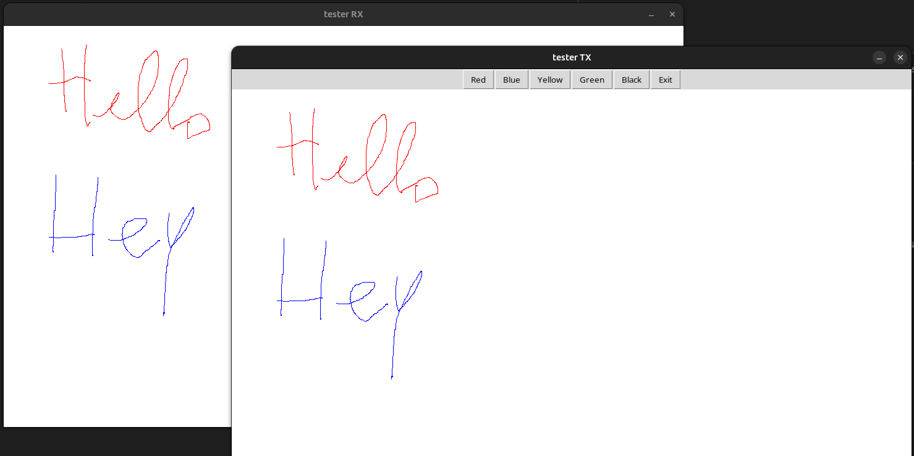

## Brief

backend for the blackboard app. socket-based forward engine that enables sending drawing data from one application to another

* contains tx and rx test applications 
* contains all-in-one build environment

## How to run

*Note*: this has been tested on a Linux machine

* run `tools/scripts/setup/setup.sh` to install dependencies
* run `python build.py` to build the project
* run `python build.py -r` to run the server right after build
* run `python build.py -r -tx` to run the server alongside the TX test application
* run `python build.py -r -rx` to run the server alongside the RX test application
* run `python build.py -r -tx -rx` to run the server alongside the both test applications

tester apps can be seen in the image attached below

